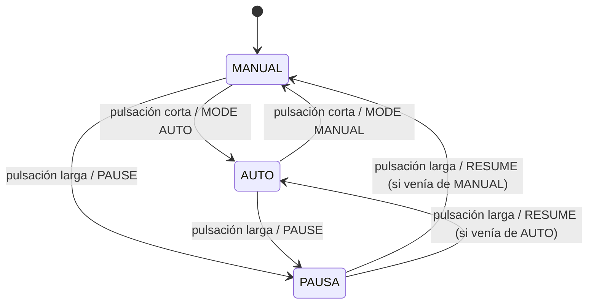

# Controlador de iluminación con consola serial (STM32 NUCLEO-F446RE)

Primer Parcial 1L C3-2026 · Code Challenge · Aplicación bare-metal en C, sin RTOS.

- Estudiante: Josué Hiraldo
- Matrícula: 20240705
- Placa: STM32 NUCLEO-F446RE (MCU STM32F446RETx, Cortex-M4)

> **Adaptación de placa.** El enunciado está planteado para la FRDM-MCXA156.
> Con autorización del docente, el trabajo se implementa en la NUCLEO-F446RE,
> usando los periféricos equivalentes que se listan abajo.

## Versiones de herramientas

| Herramienta | Versión |
|---|---|
| STM32CubeIDE | 2.2.0 |
| STM32CubeMX | 6.18.1 |
| Paquete de firmware | STM32Cube FW_F4 V1.28.3 |
| Terminal serie | Tera Term |

## Equivalencias con el enunciado

| Enunciado (FRDM-MCXA156) | Esta implementación (NUCLEO-F446RE) |
|---|---|
| PWM por CTIMER, pin P3_12 | TIM3, canal 1, pin PA6 |
| Tick de 1 ms con CTIMER | TIM6, interrupción de actualización |
| LPUART por MCU-Link | USART2 (PA2/PA3) por el ST-LINK |
| Pulsador con interrupción GPIO | B1 (PC13) con EXTI13, ambos flancos |
| LED de estado de la placa | LD2 (PA5) |

## Tabla de recursos

| Función | Pin | Conector | Polaridad | Periférico / canal | Reloj | IRQ |
|---|---|---|---|---|---|---|
| LED de estado | PA5 | LD2 de la placa | Activo en alto | GPIO de salida | — | — |
| Pulsador de usuario | PC13 | B1 de la placa | Activo en bajo | EXTI13, ambos flancos, pull-up | — | EXTI15_10_IRQn |
| PWM al LED externo | PA6 | CN5, pin 5 (D12) | Activo en alto | TIM3_CH1, PWM mode 1 | 84 MHz | Ninguna |
| Tick de 1 ms | — | — | — | TIM6 | 84 MHz | TIM6_DAC_IRQn |
| Consola serie | PA2 (TX), PA3 (RX) | Puerto serie virtual del ST-LINK | — | USART2, 115200 8N1 | 42 MHz (PCLK1) | USART2_IRQn |

Sin conflictos de pin mux entre estas funciones.

## Reloj efectivo y cálculos

Configuración de reloj (captura en `evidencias/`): HSI 16 MHz → PLL → SYSCLK = HCLK = 84 MHz.
APB1 = 42 MHz (prescaler /2) y relojes de timer de APB1 = 84 MHz. TIM3 y TIM6 cuelgan de APB1.

| Timer | Prescaler | Período (ARR) | Resultado |
|---|---|---|---|
| TIM6 | 83 | 999 | 84 MHz / 84 = 1 MHz; / 1000 = 1 kHz (tick de 1 ms) |
| TIM3 a 500 Hz | 83 | 1999 | 1 MHz / 2000 = 500 Hz |
| TIM3 a 1000 Hz | 83 | 999 | 1 MHz / 1000 = 1000 Hz |
| TIM3 a 2000 Hz | 83 | 499 | 1 MHz / 500 = 2000 Hz |

El valor de comparación es CCR = duty × (ARR + 1) / 100. Para 100 % se usa CCR = ARR + 1.
La base de tiempo de 1 ms (TIM6) no cambia al modificar la frecuencia del PWM (TIM3).

## Esquema de conexiones

- PA6 (CN5, pin 5, D12) → resistencia de 1 kΩ → ánodo del LED externo → cátodo a GND (CN5, pin 7).
- USB del ST-LINK a la PC: alimentación, programación y puerto serie virtual.

## Diagrama de estados

## Compilación y ejecución

1. Abrir STM32CubeIDE 2.2.0 e importar `Parcial_20240705` con
   *Import STM32 Project → STM32CubeMX/STM32CubeIDE Project*.
2. Compilar con *Build Project*.
3. Cargar con *Run* o *Debug* usando el ST-LINK de la placa.
4. Abrir el puerto serie virtual del ST-LINK a 115200 baudios, 8 bits, sin paridad,
   1 bit de parada y sin control de flujo.

## Estructura del repositorio

| Carpeta | Contenido |
|---|---|
| `Parcial_20240705/` | Proyecto de STM32CubeIDE (`Src/`, `Inc/`, `Drivers/`, `.ioc`) |
| `analisis/` | Documentos de diseño |
| `pruebas/` | Registros de las pruebas de aceptación |
| `evidencias/` | Capturas, mediciones y enlace al video |

## Código del SDK y aporte propio

- Generado por CubeMX y HAL: `Drivers/`, inicialización de periféricos (`gpio.c`, `tim.c`,
  `usart.c`), `main.c` base y manejadores de interrupción generados.
- Aporte propio: PENDIENTE, aún no hay código propio.

## Pruebas de aceptación

| Prueba | Resultado esperado | Estado |
|---|---|---|
| Encendido | MANUAL, 1000 Hz, 25 %, STREAM OFF | Pendiente |
| DUTY 0 / 50 / 100 | Nivel bajo / 50 % / nivel alto | Pendiente |
| FREQ 500 / 1000 / 2000 | Error de frecuencia ≤ 2 %; el tick sigue en 1 ms | Pendiente |
| AUTO durante 3,2 s | Vuelve a 10 % tras subir a 90 % y bajar | Pendiente |
| 20 pulsaciones cortas | 20 eventos, sin duplicados | Pendiente |
| Mantener el botón 3 s | Una larga; al soltar no genera corta | Pendiente |
| PAUSA desde AUTO y RESUME | Duty 0 en pausa; continúa desde el valor y la dirección guardados | Pendiente |
| DUTY 20abc / -1 / 101 | ERR, sin modificar el duty | Pendiente |
| Línea de 100 caracteres y luego STATUS | ERR OVERFLOW; STATUS posterior funciona | Pendiente |
| CR, LF y CRLF | Una ejecución por orden | Pendiente |
| STREAM ON con 10 órdenes/s por 30 s | Sin reinicios ni pérdidas | Pendiente |
| Desbordamiento de RX provocado | Error contabilizado y recuperación en la siguiente línea | Pendiente |
| Tiempo cerca de UINT32_MAX | La temporización continúa al desbordar | Pendiente |

Verificación de frecuencia y duty del PWM: PENDIENTE: se completará con el método usado y los resultados.

## Hitos y commits

| Hito | Estado |
|---|---|
| 1. GPIO y consola | Pendiente |
| 2. Interrupciones y antirrebote | Pendiente |
| 3. TIMER y PWM | Pendiente |
| 4. Integración y comandos | Pendiente |
| 5. Pruebas y correcciones | Pendiente |

## Estado actual

- Hecho: proyecto base generado con CubeMX (TIM3 PWM, TIM6 tick, USART2, EXTI13 y LD2) y
  compilado sin errores ni advertencias.
- Pendiente: toda la lógica de la aplicación, las pruebas de aceptación, las evidencias y el video.
- Errores conocidos: ninguno registrado todavía.
