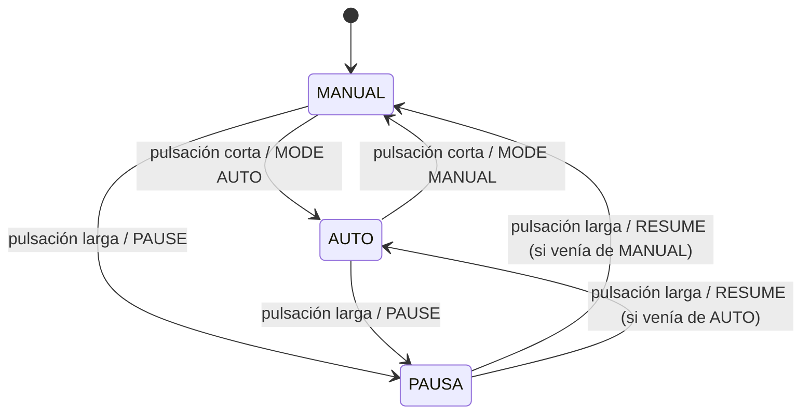
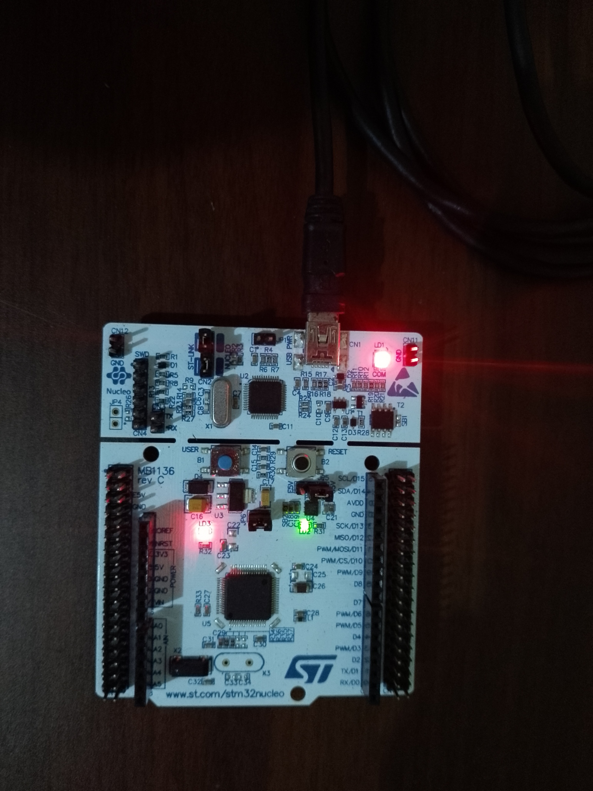
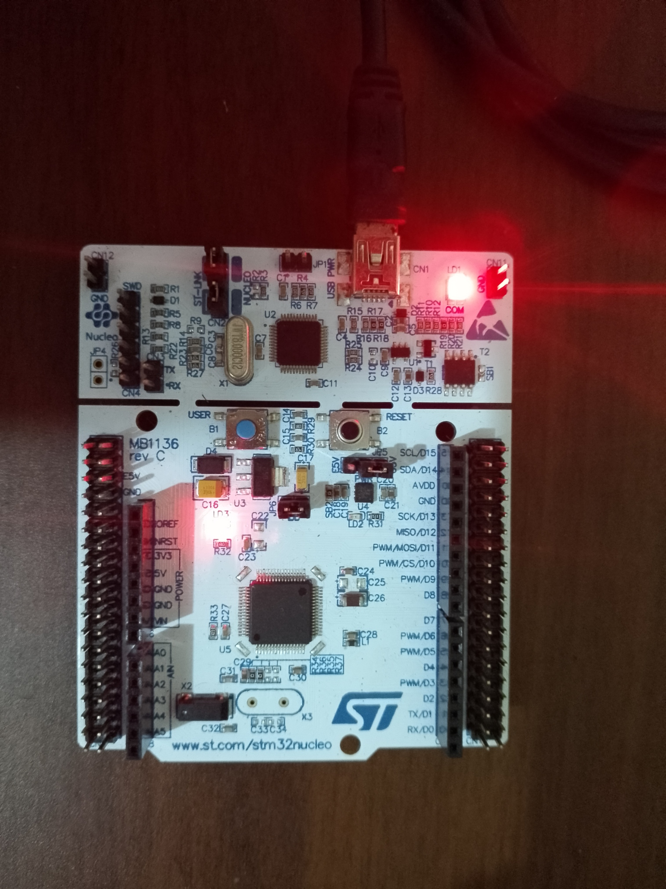
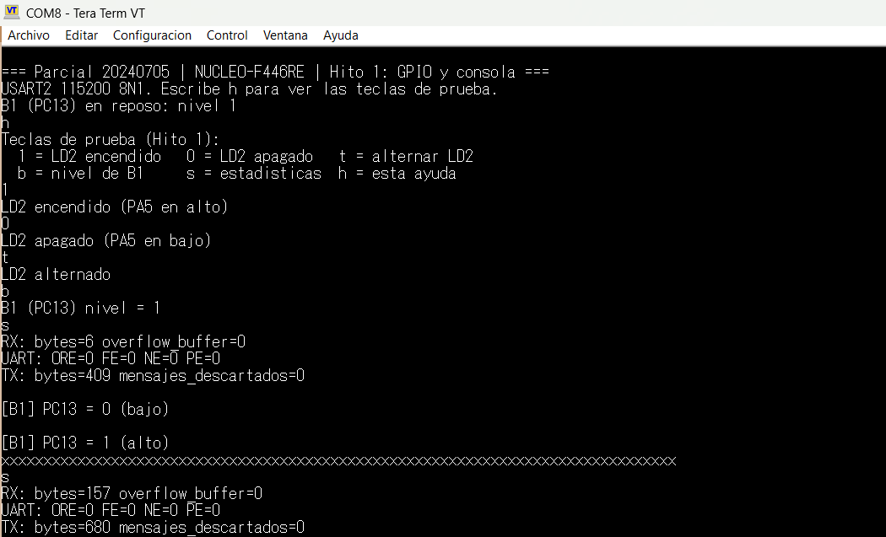
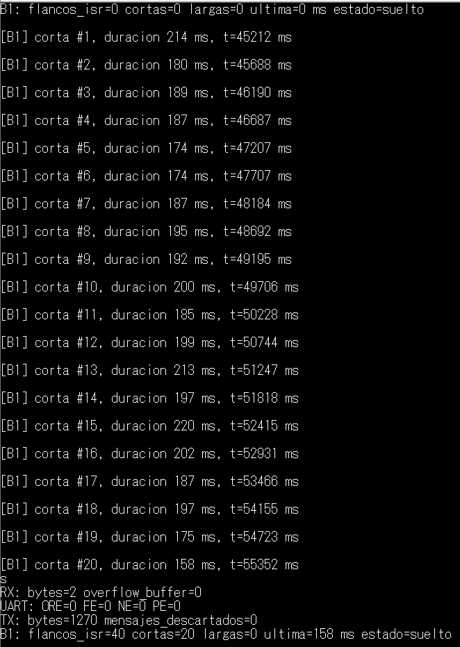
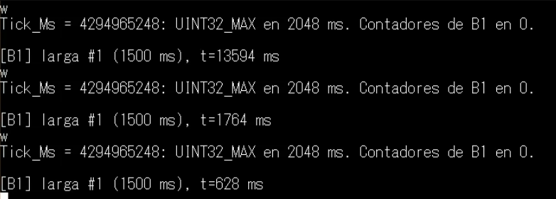

# Controlador de iluminación con consola serial (STM32 NUCLEO-F446RE)

Primer Parcial 1L C3-2026 · Code Challenge · Aplicación bare-metal en C, sin RTOS.

- Estudiante: Josué Hiraldo
- Matrícula: 20240705
- Placa: STM32 NUCLEO-F446RE (MCU STM32F446RETx, Cortex-M4)

> **Adaptación de placa.** El enunciado está planteado para la FRDM-MCXA156.
> Con autorización del docente, el trabajo se implementa en la NUCLEO-F446RE,
> usando los periféricos equivalentes que se listan abajo.

## Versiones de herramientas

| Herramienta | Versión |
|---|---|
| STM32CubeIDE | 2.2.0 |
| STM32CubeMX | 6.18.1 |
| Paquete de firmware | STM32Cube FW_F4 V1.28.3 |
| Terminal serie | Tera Term |

## Equivalencias con el enunciado

| Enunciado (FRDM-MCXA156) | Esta implementación (NUCLEO-F446RE) |
|---|---|
| PWM por CTIMER, pin P3_12 | TIM3, canal 1, pin PA6 |
| Tick de 1 ms con CTIMER | TIM6, interrupción de actualización |
| LPUART por MCU-Link | USART2 (PA2/PA3) por el ST-LINK |
| Pulsador con interrupción GPIO | B1 (PC13) con EXTI13, ambos flancos |
| LED de estado de la placa | LD2 (PA5) |

## Tabla de recursos

| Función | Pin | Conector | Polaridad | Periférico / canal | Reloj | IRQ |
|---|---|---|---|---|---|---|
| LED de estado | PA5 | LD2 de la placa | Activo en alto | GPIO de salida | — | — |
| Pulsador de usuario | PC13 | B1 de la placa | Activo en bajo | EXTI13, ambos flancos, pull-up | — | EXTI15_10_IRQn |
| PWM al LED externo | PA6 | CN5, pin 5 (D12) | Activo en alto | TIM3_CH1, PWM mode 1 | 84 MHz | Ninguna |
| Tick de 1 ms | — | — | — | TIM6 | 84 MHz | TIM6_DAC_IRQn |
| Consola serie | PA2 (TX), PA3 (RX) | Puerto serie virtual del ST-LINK | — | USART2, 115200 8N1 | 42 MHz (PCLK1) | USART2_IRQn |

Sin conflictos de pin mux entre estas funciones.

Polaridades medidas en la placa durante el Hito 1: LD2 es activo en alto (PA5 en alto = encendido)
y B1 es activo en bajo (reposo = 1, pulsado = 0). Detalle en `pruebas/hito1_resultados.md`.

## Reloj efectivo y cálculos

Configuración de reloj (captura en `evidencias/`): HSI 16 MHz → PLL → SYSCLK = HCLK = 84 MHz.
APB1 = 42 MHz (prescaler /2) y relojes de timer de APB1 = 84 MHz. TIM3 y TIM6 cuelgan de APB1.

| Timer | Prescaler | Período (ARR) | Resultado |
|---|---|---|---|
| TIM6 | 83 | 999 | 84 MHz / 84 = 1 MHz; / 1000 = 1 kHz (tick de 1 ms) |
| TIM3 a 500 Hz | 83 | 1999 | 1 MHz / 2000 = 500 Hz |
| TIM3 a 1000 Hz | 83 | 999 | 1 MHz / 1000 = 1000 Hz |
| TIM3 a 2000 Hz | 83 | 499 | 1 MHz / 500 = 2000 Hz |

El valor de comparación es CCR = duty × (ARR + 1) / 100. Para 100 % se usa CCR = ARR + 1.
La base de tiempo de 1 ms (TIM6) no cambia al modificar la frecuencia del PWM (TIM3).

## Esquema de conexiones

- PA6 (CN5, pin 5, D12) → resistencia de 1 kΩ → ánodo del LED externo → cátodo a GND (CN5, pin 7).
- USB del ST-LINK a la PC: alimentación, programación y puerto serie virtual.

## Diagrama de estados

## Compilación y ejecución

1. Abrir STM32CubeIDE 2.2.0 e importar `Parcial_20240705` con
   *Import STM32 Project → STM32CubeMX/STM32CubeIDE Project*.
2. Compilar con *Build Project*.
3. Cargar con *Run* o *Debug* usando el ST-LINK de la placa.
4. Abrir el puerto serie virtual del ST-LINK a 115200 baudios, 8 bits, sin paridad,
   1 bit de parada y sin control de flujo.

## Estructura del repositorio

| Carpeta | Contenido |
|---|---|
| `Parcial_20240705/` | Proyecto de STM32CubeIDE (`Src/`, `Inc/`, `Drivers/`, `.ioc`) |
| `analisis/` | Documentos de diseño (`uart_buffers.md`: buffers UART; `tick_y_antirrebote.md`: tick, EXTI y antirrebote) |
| `pruebas/` | Resultados de pruebas (`hito1_resultados.md`, `hito2_resultados.md`) y pruebas de lógica en PC (`host/`) |
| `evidencias/` | Capturas, fotos, mediciones y enlace al video (`hito1/`, `hito2/`) |

## Código del SDK y aporte propio

- Generado por CubeMX y HAL: `Drivers/`, inicialización de periféricos (`gpio.c`, `tim.c`,
  `usart.c`), `main.c` base y manejadores de interrupción generados.
- Código de la aplicación (no generado por CubeMX ni incluido en el HAL), en `Inc/` y `Src/`:
  - `ringbuf.c/.h`: buffer circular con un productor y un consumidor.
  - `console.c/.h`: consola UART no bloqueante (RX por interrupción, cola TX, contadores de errores).
  - `tick.c/.h`: base de tiempo de 1 ms con la interrupción de TIM6 (SysTick queda solo para el HAL).
  - `button.c/.h`: pulsador B1 con EXTI en ambos flancos, antirrebote de 30 ms y pulsación corta/larga.
  - `app_config.h`: pines, polaridades, tiempos del pulsador y tamaños de buffer.
  - `app.c/.h`: arranque y pruebas temporales de los Hitos 1 y 2 (se reemplazan en los hitos siguientes).
- Cambios en archivos generados: solo tres líneas en los bloques `USER CODE` de `main.c`
  (`#include "app.h"`, `App_Init();` y `App_Loop();`).
- `pruebas/host/`: pruebas de lógica que se compilan en un PC con funciones simuladas del HAL.

## Pruebas de aceptación

| Prueba | Resultado esperado | Estado |
|---|---|---|
| Encendido | MANUAL, 1000 Hz, 25 %, STREAM OFF | Pendiente |
| DUTY 0 / 50 / 100 | Nivel bajo / 50 % / nivel alto | Pendiente |
| FREQ 500 / 1000 / 2000 | Error de frecuencia ≤ 2 %; el tick sigue en 1 ms | Pendiente |
| AUTO durante 3,2 s | Vuelve a 10 % tras subir a 90 % y bajar | Pendiente |
| 20 pulsaciones cortas | 20 eventos, sin duplicados | Pendiente |
| Mantener el botón 3 s | Una larga; al soltar no genera corta | Pendiente |
| PAUSA desde AUTO y RESUME | Duty 0 en pausa; continúa desde el valor y la dirección guardados | Pendiente |
| DUTY 20abc / -1 / 101 | ERR, sin modificar el duty | Pendiente |
| Línea de 100 caracteres y luego STATUS | ERR OVERFLOW; STATUS posterior funciona | Pendiente |
| CR, LF y CRLF | Una ejecución por orden | Pendiente |
| STREAM ON con 10 órdenes/s por 30 s | Sin reinicios ni pérdidas | Pendiente |
| Desbordamiento de RX provocado | Error contabilizado y recuperación en la siguiente línea | Pendiente |
| Tiempo cerca de UINT32_MAX | La temporización continúa al desbordar | Pendiente |

Resultados de las pruebas previas de GPIO y consola (Hito 1): `pruebas/hito1_resultados.md`.
Resultados de tick, interrupción del botón y antirrebote (Hito 2): `pruebas/hito2_resultados.md`.
Las pruebas de aceptación de «20 pulsaciones cortas», «Mantener el botón 3 s» y «Tiempo cerca de UINT32_MAX»
se hicieron en el Hito 2 con la aplicación de prueba y se repetirán con la aplicación integrada (Hito 5).

Verificación de frecuencia y duty del PWM: PENDIENTE: se completará con el método usado y los resultados.

## Hitos y commits

| Hito | Estado | Commits y evidencia |
|---|---|---|
| 1. GPIO y consola | Hecho (2026-10-09) | `Agrego buffer circular y consola UART2 no bloqueante`; `Hito 1: pruebo LD2, lectura de B1 y consola por USART2`; `Hito 1: agrego evidencias, analisis de buffers y resultados`. Evidencias en `evidencias/hito1/` |
| 2. Interrupciones y antirrebote | Hecho (2026-10-10) | `Agrego tick de 1 ms con interrupcion de TIM6`; `Agrego boton B1 con EXTI en ambos flancos y antirrebote de 30 ms`; `Hito 2: integro tick y boton en la app, con pruebas en PC y analisis`; commit de evidencias del Hito 2. Evidencias en `evidencias/hito2/` |
| 3. TIMER y PWM | Pendiente | — |
| 4. Integración y comandos | Pendiente | — |
| 5. Pruebas y correcciones | Pendiente | — |

### Hito 1: GPIO y consola

- Compilación: 0 errores y 0 advertencias (text 21 232 B, data 92 B, bss 3 980 B).
- Consola por USART2 a 115200 8N1: banner, teclas de prueba y contadores de errores sin fallos.
- LD2: se enciende con la tecla `1` y se apaga con `0`; activo en alto.
- B1: nivel 1 en reposo y 0 al pulsar; activo en bajo. En este hito se lee por sondeo solo para medir la polaridad.
- Una ráfaga de más de 128 caracteres pasó sin pérdidas: `overflow_buffer=0`, `mensajes_descartados=0`, `ORE/FE/NE/PE=0`.

| LD2 encendido (tecla `1`) | LD2 apagado (tecla `0`) |
|---|---|
|  |  |

Más evidencia: `evidencias/hito1/01_compilacion_0_errores.png` y `evidencias/hito1/02_carga_en_placa.png`.

### Hito 2: interrupciones, tick y antirrebote

- Tick de 1 ms con la interrupción de TIM6 (PSC 83, ARR 999). La comparación con SysTick dio una diferencia acumulada de 1 ms en unos 9,5 s.
- B1 por interrupción EXTI13 en ambos flancos. La ISR solo incrementa un contador de flancos; el antirrebote de 30 ms, la clasificación y los contadores se hacen en `main`, una vez por tick.
- Pulsación corta (de 30 ms a menos de 1500 ms, al soltar) y larga (una sola vez al llegar a 1500 ms, sin corta al soltar). Las duraciones se miden sobre el estado ya validado.
- 20 pulsaciones cortas dieron 20 eventos y 40 flancos (`flancos_isr`); mantener 10,7 s dio una sola larga; arrancar con B1 pulsado no genera eventos.
- Todas las diferencias de tiempo usan `(uint32_t)(ahora - antes)`. Con la tecla de prueba `w` se inyectó el contador a 2048 ms de UINT32_MAX y una pulsación larga cruzó el desbordamiento (`t=628 ms` tras la vuelta).
- Limitación: el botón casi no rebotó en la placa (2 flancos por pulsación); el filtrado de rebotes se verificó con rebotes simulados en las pruebas de PC.

Más evidencia en `evidencias/hito2/` y detalle en `pruebas/hito2_resultados.md` y `analisis/tick_y_antirrebote.md`.

## Estado actual

- Hecho: proyecto base generado con CubeMX (TIM3 PWM, TIM6 tick, USART2, EXTI13 y LD2),
  Hito 1 (GPIO y consola) y Hito 2 (tick de 1 ms, EXTI de B1 y antirrebote) probados en la placa.
- Pendiente: PWM con TIM3, máquina de estados, parser de comandos, pruebas de aceptación,
  evidencias del PWM y el video.
- Limitaciones conocidas: las teclas de prueba (`1`, `0`, `t`, `b`, `s`, `h`, `m`, `w`) y las acciones de B1
  (corta = alternar LD2, larga = apagar LD2) son temporales; se reemplazan en el Hito 4.
- Errores conocidos: ninguno registrado en los Hitos 1 y 2.
