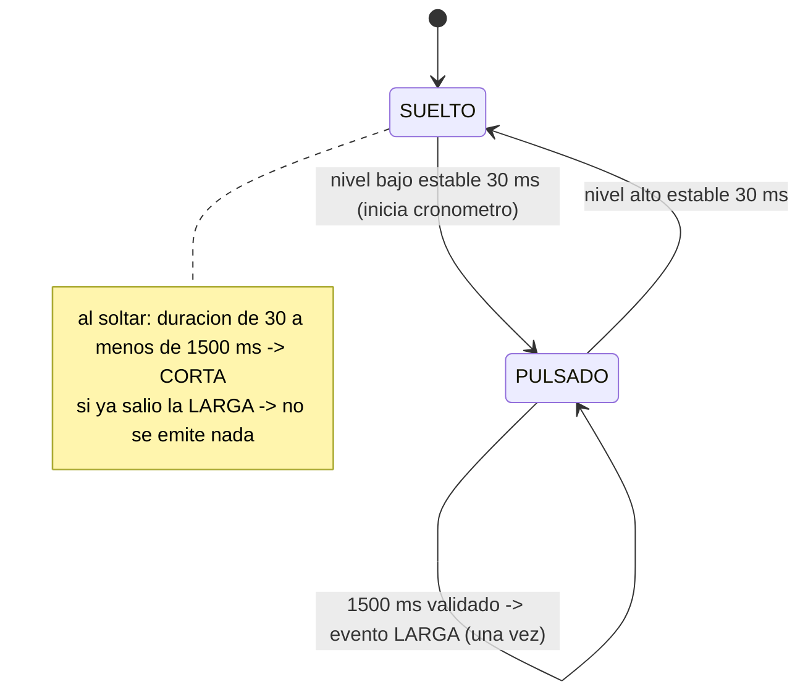

# Analisis: tick de 1 ms, interrupcion del pulsador y antirrebote

Aplica a `Src/tick.c`, `Src/button.c`, `Inc/app_config.h` y `Src/app.c`.

## 1. Tick de 1 ms con TIM6

| Dato | Valor |
|---|---|
| Reloj del timer (APB1 timer clock) | 84 MHz |
| Preescalador (PSC) | 83 -> 84 MHz / 84 = 1 MHz (1 us por cuenta) |
| Periodo (ARR) | 999 -> 1000 cuentas = **1 ms** |
| Interrupcion | actualizacion de TIM6 (`TIM6_DAC_IRQn`) |

- La ISR (`HAL_TIM_PeriodElapsedCallback`) solo hace `s_ms++`. Nada de impresion, esperas ni logica.
- SysTick queda para uso interno del HAL. La aplicacion mide el tiempo solo con `Tick_Ms()` (TIM6).
- `Tick_Init()` borra la bandera UIF antes de arrancar: la inicializacion de TIM6 la deja levantada y, sin borrarla, se contaria 1 ms de mas al arrancar.
- El contador es de 32 bits: la lectura es atomica en el Cortex-M4 y la escribe solo la ISR.

### Desbordamiento de uint32

`Tick_Ms()` da la vuelta a los 2^32 ms = 4 294 967 296 ms = **49,7 dias**.

- Forma correcta: `(uint32_t)(ahora - antes) >= limite`.
- Ejemplo: `antes = 0xFFFFFFFE`, `ahora = 3` -> `(uint32_t)(3 - 0xFFFFFFFE) = 5` ms. Correcto.
- Forma incorrecta: `ahora >= antes + limite`. Con `antes = 0xFFFFFFFE` y `limite = 30`, `antes + limite` da la vuelta y vale 28, asi que la condicion se cumple de inmediato (falso positivo).
- Esto vale para intervalos menores que 2^32 ms; los de este proyecto son de 1,5 s o menos.
- Prueba en PC: `test_tick.c` y `test_button.c` cruzan el desbordamiento con pulsaciones cortas y largas.
- Prueba en la placa: la tecla `w` pone el contador 2048 ms antes de UINT32_MAX (`Tick_SetMs`) y reinicia las marcas de tiempo y contadores del boton. Es la "prueba inyectada" del enunciado. Procedimiento: pulsar `w`, esperar 1 s y mantener B1 3 s. Cada mensaje `[B1]` incluye `t=` (el valor de `Tick_Ms()` al emitirlo). Una larga se emite exactamente 1500 ms despues de validar la pulsacion. Por tanto, si `t` es menor de 1500 ms (valor ya posterior a la vuelta), la pulsacion se valido en `t - 1500`, es decir, antes del desbordamiento, y la temporizacion de 1500 ms lo cruzo. Si `t` sale mayor de 4 000 000 000, la larga salio antes de la vuelta; si sale mayor de 1500 ms pero pequeno, la pulsacion empezo despues de la vuelta. En ambos casos hay que repetir.

## 2. Interrupcion del pulsador (EXTI13, ambos flancos)

Camino de una pulsacion:

1. PC13 cambia de nivel -> EXTI13 -> NVIC (`EXTI15_10_IRQn`).
2. `EXTI15_10_IRQHandler` (generado por CubeMX) llama a `HAL_GPIO_EXTI_IRQHandler(GPIO_PIN_13)`.
3. El HAL borra la bandera pendiente y llama a `HAL_GPIO_EXTI_Callback`.
4. Nuestro callback hace una sola cosa: `s_isrEdges++` (solo para el pin PC13).

Decisiones de diseno:

- **Contador en vez de bandera.** Una bandera fusiona varios flancos y obliga a borrarla desde `main` (carrera entre ISR y `main`). Con un contador, la ISR es la unica que escribe y `main` solo compara el valor con el que vio la ultima vez: no hay secciones criticas. Ademas da un dato de depuracion (flancos vistos con rebotes, contra pulsaciones validadas).
- **El contador no es el numero de pulsaciones.** Un solo clic puede producir decenas de flancos por los rebotes.
- **La ISR no mide tiempo ni decide nada.** Toda la logica esta en `main`.
- El vector EXTI15_10 es compartido con los pines 10 a 15, pero solo se usa PC13, y el HAL solo atiende el pin que se le indica.

## 3. Antirrebote y clasificacion (`Button_Service`, una vez por tick)

Constantes en `app_config.h`: `APP_DEBOUNCE_MS = 30`, `APP_SHORT_MIN_MS = 30`, `APP_LONG_PRESS_MS = 1500`.

Cada milisegundo, `main`:

1. Si el contador de la ISR cambio desde la ultima vez, **reinicia la ventana de 30 ms** (aunque el pin se vea igual: pudo rebotar entre dos muestras).
2. Si el nivel muestreado cambio respecto al candidato, **reinicia la ventana**.
3. Si el candidato difiere del estado validado y lleva **30 ms o mas estable**, el estado validado cambia (se valida la pulsacion o la liberacion).
4. Si esta pulsado (validado) y pasaron **1500 ms**, emite la pulsacion larga **una sola vez**.

Reglas del enunciado y como se cumplen:

| Regla | Como se cumple |
|---|---|
| Cambio confirmado tras 30 ms estables | Ventana de 30 ms que se reinicia con cada cambio o flanco |
| Corta: de 30 ms a menos de 1500 ms, al soltar | Se clasifica al validar la liberacion con `dur >= 30 && dur < 1500` |
| Larga: una vez al llegar a 1500 ms | Bandera `s_longFired` |
| Al soltar tras la larga no hay corta | Si `s_longFired` esta activa, la liberacion no emite evento |
| Mantener pulsado no repite | `s_longFired` solo se limpia al validar una nueva pulsacion |
| Duracion sobre el estado ya validado | `dur = soltar_validado - pulsar_validado` (ambos con 30 ms de retardo, asi que para una pulsacion estable coincide con la fisica, mas o menos 1 ms) |
| Contar cortas y largas por separado | `shortCount` y `longCount` |

Tiempos medidos en la simulacion (tick de 1 ms):

- Pulsacion validada: 31 ms despues del flanco fisico (30 ms de ventana + 1 ms de muestreo).
- Larga: a los 1531 ms del flanco fisico (31 ms + 1500 ms).
- Corta: se emite unos 31 ms despues de soltar.
- El evento validado se imprime en la misma vuelta de `main` en que se valida (el enunciado pide 50 ms como maximo). Un mensaje de unos 40 caracteres tarda 40 x 86,8 us = 3,5 ms en salir por la UART.

Casos especiales:

- **B1 pulsado al arrancar:** esa pulsacion no genera ningun evento (ni corta ni larga) y el boton funciona normal en cuanto se suelta.
- **Pulsos de ruido de menos de 30 ms:** no se validan.
- **Si `main` se retrasa:** las diferencias se calculan con `nowMs` y no con el numero de llamadas, por lo que una vuelta lenta no cambia los tiempos medidos.

## 4. Acciones temporales de este hito (`app.c`)

Solo sirven para ver el resultado en la placa: corta = alternar LD2, larga = apagar LD2. En el Hito 4 se sustituyen por la maquina de estados (corta: MANUAL/AUTO; larga: PAUSA).

Teclas nuevas: `m` compara el avance de TIM6 con el de SysTick desde la ultima pulsacion de `m`; `w` inyecta el tiempo cerca de UINT32_MAX. Los mensajes `[B1]` muestran el instante `t` (ms de `Tick_Ms()`). La tecla `s` ahora muestra tambien `flancos_isr`, `cortas`, `largas`, la ultima duracion y el estado del boton.

Limitacion: TIM6 y SysTick salen del mismo reloj (HCLK), asi que `m` comprueba que TIM6 cuenta de verdad 1 ms por interrupcion, pero no mide la exactitud absoluta del reloj (HSI interno).

## 5. Preguntas que debo saber responder en la defensa

- **Por que la ISR solo cuenta?** Para que sea corta y no haya carreras: el contador lo escribe solo la ISR y `main` lo lee.
- **Por que un contador y no una bandera?** La bandera funde varios flancos y hay que borrarla desde `main`; el contador no necesita borrarse y permite comparar flancos con pulsaciones.
- **Como se mide el estado estable de 30 ms?** Cada tick se muestrea el pin; si el nivel cambia o la ISR vio un flanco, se reinicia el cronometro; al llegar a 30 ms se acepta el cambio.
- **Que pasa con un rebote mas corto que 1 ms?** El contador de la ISR lo delata aunque el pin se vea igual en la muestra, y la ventana se reinicia.
- **Por que `(uint32_t)(ahora - antes)`?** Es correcto aunque el contador de 32 bits de la vuelta; la comparacion directa falla en el desbordamiento.
- **Cuanto tarda en dar la vuelta el contador?** 2^32 ms, unos 49,7 dias.
- **Como evito la corta al soltar tras una larga?** Con `s_longFired`: si ya salio la larga, la liberacion no emite evento.
- **Como cambio el tiempo de la larga a 2 s?** Se cambia `APP_LONG_PRESS_MS` en `app_config.h` a `2000U` y se vuelve a compilar.
- **Que pasa si arranco con el boton pulsado?** No genera eventos hasta que se suelte.
